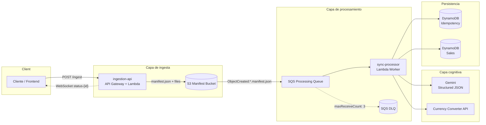

# Alegra Sync Bridge

En ecosistemas contables, el cuello de botella rara vez es “guardar un dato”, sino **entenderlo**. Las fuentes llegan en formatos distintos — JSON de integraciones, XML de facturación electrónica, texto plano, capturas de tickets — y cada una exige lógica ad hoc para convertirla en un registro confiable. **Alegra Sync Bridge** resuelve ese problema como un **puente de sincronización**: recibe lo que el negocio ya tiene, lo acepta sin fricción y lo transforma en un modelo de venta unificado, listo para operar en el resto del stack.

Desde la perspectiva de producto, el servicio ofrece una experiencia **rápida y predecible**: el cliente envía su información (payload + adjuntos opcionales) y recibe al instante un identificador de transacción (`transactionId`) para hacer seguimiento. El trabajo pesado — lectura de documentos, extracción de campos contables, conversión de moneda, validación de duplicados y persistencia — ocurre en segundo plano, sin bloquear la interfaz ni comprometer la disponibilidad de la API.

Bajo el capó, el bridge combina un diseño **event-driven serverless** con una capa de **inteligencia estructurada**: un modelo multimodal (texto e imágenes) infiere país, monto, moneda, comercio, categoría y folio de factura, pero la salida no es texto libre — está acotada por un esquema de dominio y validada antes de escribir en base de datos. Eso permite absorber heterogeneidad en la entrada sin sacrificar rigor en la salida: la IA acelera la normalización; el schema, la idempotencia y el almacenamiento durable definen la verdad del sistema.

En conjunto, Alegra Sync Bridge es el **adaptador entre el mundo real de los comprobantes y el modelo digital de ventas**: durable, idempotente, observable y preparado para escalar por eventos, no por hilos bloqueados.

---

## Arquitectura

El sistema sigue el patrón **Accept → Store → React**: la API acepta y persiste; la infraestructura reacciona cuando el manifiesto está listo.



| Capa | Responsabilidad |
|------|-----------------|
| **Ingesta** | Expone `POST /ingest`, sube adjuntos y manifiesto a S3, responde con ULID y notifica el primer paso vía WebSocket |
| **Orquestación** | S3 notifica a SQS; el worker consume mensajes de forma aislada (batch size 1) |
| **Cognitiva** | Extracción schema-first con Gemini; conversión FX a USD |
| **Persistencia** | Lock idempotente por `billId` y registro final de venta en DynamoDB |
| **Resiliencia** | Cola de procesamiento con DLQ tras 3 reintentos fallidos |

La ingesta y el procesamiento corren en **Lambdas separadas**: la API permanece liviana y stateless; el worker concentra CPU, memoria (512 MB) y timeout extendido (60 s) para IA y E/S contra S3.

---

## Stack tecnológico

| Área | Tecnología |
|------|------------|
| Runtime | Node.js 22 · TypeScript 5 |
| Framework | NestJS 11 — módulos, inyección de dependencias, validación de configuración (Joi) |
| Serverless | AWS Lambda · API Gateway · S3 · SQS · DynamoDB |
| IaC | [Serverless Framework](https://www.serverless.com/) — `serverless.yml` |
| IA | Google GenAI (`@google/genai`) — salida JSON con `responseJsonSchema` |
| Validación de dominio | Zod + `zod-to-json-schema` |
| Adaptador HTTP en Lambda | `@vendia/serverless-express` |
| Tiempo real | Socket.IO (`@nestjs/websockets`) |
| Observabilidad | CloudWatch Logs |
| Documentación API | Swagger (solo fuera de `prod`) |

---

## Infraestructura como código

Todo el stack AWS se declara en `serverless.yml`. Un `sls deploy` provisiona recursos, permisos y funciones de forma reproducible por stage (`dev`, `prod`, etc.).

| Recurso | Nombre | Propósito |
|---------|--------|-----------|
| **S3** | `alegra-sync-bridge-manifests-{stage}` | Manifiestos JSON y archivos adjuntos por transacción |
| **SQS** | `alegra-sync-bridge-processing-queue-{stage}` | Buffer entre el evento S3 y el worker (visibility 60 s) |
| **SQS DLQ** | `alegra-sync-bridge-dlq-{stage}` | Mensajes fallidos — retención 14 días para análisis o replay |
| **DynamoDB** | `...-idempotency-{stage}` | Locks por transacción duplicada (TTL 3 días) |
| **DynamoDB** | `...-sales-{stage}` | Ventas normalizadas en USD |
| **Lambda** | `ingestion-api` | Handler HTTP — `POST /ingest` |
| **Lambda** | `sync-processor` | Consumer SQS — pipeline de extracción y persistencia |

**IAM** con mínimo privilegio en el mismo manifiesto: lectura/escritura en el bucket de manifiestos, operaciones SQS sobre la cola de procesamiento, y `PutItem` / `GetItem` / `UpdateItem` en DynamoDB según tabla.

**Disparador S3 → SQS:** solo objetos con sufijo `manifest.json`, configurado en `NotificationConfiguration`, de modo que la subida de adjuntos no dispare procesamiento prematuro.

**Región y runtime:** `us-east-1`, Node.js 22.x en Lambda.

---

## Flujo de procesamiento

```
1. Cliente → POST /ingest (body, query, hasta 2 archivos)
2. API genera transactionId (ULID), sube archivos y manifest.json a S3
3. API responde de inmediato con el transactionId
4. API emite WebSocket status-{transactionId} → paso 1
5. S3 ObjectCreated (*.manifest.json) encola mensaje en SQS
6. sync-processor Lambda:
   a. Descarga manifest y adjuntos desde S3
   b. Construye entrada multimodal (prompt + imágenes + payload)
   c. Gemini devuelve JSON acotado al SaleSchema; Zod valida en runtime
   d. IdempotencyRepository.createLock(hash(billId)) — rechaza duplicados
   e. ConverterService normaliza precio a USD
   f. SalesRepository.createSale() persiste el registro
7. Cliente puede seguir el avance vía Socket.IO (status-{transactionId})
```

| Etapa | Comportamiento clave |
|-------|----------------------|
| **Aceptación** | Fire-and-forget: el cliente no espera OCR, FX ni escritura en DynamoDB |
| **Durabilidad** | El manifiesto en S3 es la fuente de verdad; permite replay y auditoría |
| **Extracción** | Si faltan campos obligatorios (p. ej. `billId` nulo), el worker falla antes de persistir |
| **Idempotencia** | `attribute_not_exists(id)` en DynamoDB — la misma factura no se registra dos veces |
| **Resiliencia** | Hasta 3 intentos en SQS; luego el mensaje va a DLQ para intervención manual |

El contrato de salida del dominio es un objeto **Sale** con: `country`, `price`, `currency`, `location`, `category`, `billId` — más `id` derivado del hash de `billId` tras la validación idempotente.
